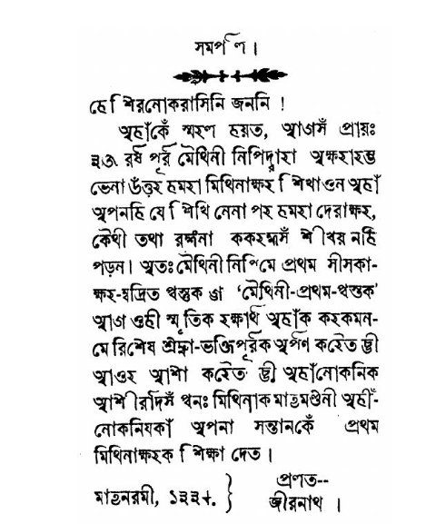



TRIBHUVAN UNIVERSITY   INSTITUTE OF ENGINEERING PULCHOWK CAMPUS

Machine Learning Analysis of Tirhuta Lipi

By:

Sumit Yadav (076/BCT/088)      Raju Kumar Yadav (076/BCT/100) Prashant Bhandari (076/BCT/049)

AN AI PROJECT REPORT TO THE DEPARTMENT OF ELECTRONICS AND COMPUTER ENGINEERING.

DEPARTMENT OF ELECTRONICS AND COMPUTER ENGINEERING LALITPUR, NEPAL

March, 2023

ii

ACKNOWLEDGEMENT

This project is prepared in partial fulfilment of the requirement for for the the bachelor’s degree in Electronics and Communication Engineering. First and foremost, We would also like to extend our sincere thanks to our passout seniors, friends, and family for their support and guidance throughout our research project. Their valuable inputs and feedback have been instrumental in shaping our ideas and improving our work.

We would also like to express our gratitude to the Department of Electronics and Computer Engineering, Pulchowk Campus, Tribhuvan University for providing us with the necessary resources and infrastructure to carry out this research.

Last but not least, we would like to thank our instructor, Basant Joshi, for his guidance, encouragement, and support throughout this project. His expertise and knowledge have been invaluable in helping us to achieve our research objectives.

Finally, we would like to acknowledge the contribution of all the authors of this research report, namely Sumit Yadav, Raju Kumar Yadav, and Prashant Bhandari, for their hard work, dedication, and collaborative efforts in producing this research.

Any kind of suggestion or criticism will be highly appreciated and acknowledged.

iii

ABSTRACT

Tirhuta Lipi is a low resource language that is primarily spoken in the Indian states of Bi- har and Terai Belt of Nepal. The script is not widely used, and there are limited resources available for language processing tasks. In this project, we have explored machine learning techniques for character recognition of the low-resource language Tirhuta Lipi. We col- lected a diverse dataset of Tirhuta vowels Lipi and preprocessed it for training machine learning models. We tested different algorithms such as Sklearn and Tensorflow Keras to evaluate their performance in character recognition. Our results showed that the mobile net embedding with logistic regression achieved the highest accuracy of 0.97. We also found that fine-tuning the mobile net model in Tensorflow Keras resulted in an accuracy of 0.965. Our study demonstrates the feasibility of using machine learning for character recognition in TirhutaLipi,whichcouldhaveimportantapplicationsinareassuchastexttranslationandop- tical character recognition. This project contributes to the growing field of natural language processing for low-resource languages and highlights the potential of machine learning in language-related tasks.

Keywords: Tirhuta Lipi, Character recognition, Digital accessibility

iv

TABLE OF CONTENTS

[TITLE PAGE](#_page0_x99.21_y99.21) i [ACKNOWLEDGEMENT](#_page0_x99.21_y99.21) ii [ABSTRACT](#_page0_x99.21_y99.21) iii [TABLE OF CONTENTS](#_page0_x99.21_y99.21) v [LIST OF FIGURES](#_page0_x99.21_y99.21) vi [1 INTRODUCTION](#_page6_x99.21_y99.21) 1

1. [Background](#_page6_x99.21_y605.12) . . . . . . . . . . . . . . . . . . . . . . . . . . . . . . . . . . 1
1. [Objectives](#_page7_x99.21_y509.28) . . . . . . . . . . . . . . . . . . . . . . . . . . . . . . . . . . . 2
1. [Problem statement](#_page7_x99.21_y664.04) . . . . . . . . . . . . . . . . . . . . . . . . . . . . . . 2
1. [Scope of Project ](#_page8_x99.21_y113.76). . . . . . . . . . . . . . . . . . . . . . . . . . . . . . . . 3

[2 LITERATURE REVIEW](#_page9_x99.21_y99.21) 4 [3 THEORETICAL BACKGROUND](#_page10_x99.21_y99.21) 5 [4 METHODOLOGY](#_page11_x99.21_y99.21) 6

1. [Data Collection Process](#_page11_x99.21_y190.02) . . . . . . . . . . . . . . . . . . . . . . . . . . . . 6
1. [Preprocessing and Cleaning of Data](#_page12_x99.21_y598.49) . . . . . . . . . . . . . . . . . . . . . 7
1. [Data Analysis and Visualization Techniques](#_page13_x99.21_y336.71) . . . . . . . . . . . . . . . . . 8
1. [Machine Learning Algorithms Used](#_page13_x99.21_y488.89) . . . . . . . . . . . . . . . . . . . . . 8

[4.4.1 Decision Tree Classification](#_page14_x99.21_y468.73) . . . . . . . . . . . . . . . . . . . . . 9

5. [Mobile Net Embedding](#_page15_x99.21_y664.64) . . . . . . . . . . . . . . . . . . . . . . . . . . . . 10
6. [Fine Tuning MobileNet](#_page16_x99.21_y429.12) . . . . . . . . . . . . . . . . . . . . . . . . . . . . 11

[5 TOOLS AND TECHNOLOGIES](#_page17_x99.21_y149.61) 12 [6 RESULTS](#_page18_x99.21_y131.68) 13

1. [Decision Tree](#_page18_x99.21_y289.83) . . . . . . . . . . . . . . . . . . . . . . . . . . . . . . . . . 13
1. [Decision Tree Analysis on Raw Data (Image)](#_page18_x99.21_y407.39) . . . . . . . . . . . . 13
1. [PCA 200 Embedding](#_page18_x99.21_y547.77) . . . . . . . . . . . . . . . . . . . . . . . . . 13
1. [Feature Vectors from MobileNet](#_page18_x99.21_y685.71) . . . . . . . . . . . . . . . . . . . 13
2. [Analysis On Different SKLearn Algorith ](#_page19_x99.21_y524.52). . . . . . . . . . . . . . . . . . . 14

[6.2.1 Fine tunning MobileNet](#_page19_x99.21_y610.04) . . . . . . . . . . . . . . . . . . . . . . . 14

v

[7 DISCUSSION](#_page20_x99.21_y99.21) 15 [8 CONCLUSION](#_page22_x99.21_y99.21) 17 [9 LIMITATIONS AND FUTURE ENHANCEMENTS](#_page23_x99.21_y99.21) 18 [REFERENCES](#_page24_x99.21_y99.21) 19 [10 IMAGES](#_page24_x99.21_y674.85) 19

vi

List of Figures

[1.1 Tirhuta Script svara varna.](#_page7_x99.21_y192.09) . . . . . . . . . . . . . . . . . . . . . . . . . . 2

1. [Written in tirhuta Script ](#_page25_x99.21_y206.29). . . . . . . . . . . . . . . . . . . . . . . . . . . . 20
1. [Data Collection Process](#_page26_x99.21_y137.09) . . . . . . . . . . . . . . . . . . . . . . . . . . . . 21
1. [Confusion matrix form the Decision tree scratch.](#_page26_x99.21_y137.09) . . . . . . . . . . . . . . 21
1. [ROC Score curve of Decision tree scratch.](#_page27_x99.21_y138.43) . . . . . . . . . . . . . . . . . . 22
1. [Learning curve to Decision tree scratch.](#_page27_x99.21_y138.43) . . . . . . . . . . . . . . . . . . . 22
1. [Images Counts.](#_page28_x99.21_y94.28) . . . . . . . . . . . . . . . . . . . . . . . . . . . . . . . . 23
1. [Pixel Distribution of Images (Histogram).](#_page28_x99.21_y94.28) . . . . . . . . . . . . . . . . . . 23
1. [Correlation between features.](#_page29_x99.21_y114.79) . . . . . . . . . . . . . . . . . . . . . . . . . 24
1. [2D TSNE.](#_page29_x99.21_y114.79) . . . . . . . . . . . . . . . . . . . . . . . . . . . . . . . . . . . 24 [10.103D T-SNE.](#_page30_x99.21_y112.74) . . . . . . . . . . . . . . . . . . . . . . . . . . . . . . . . . . 25 [10.112D PCA. ](#_page30_x99.21_y386.43). . . . . . . . . . . . . . . . . . . . . . . . . . . . . . . . . . . . 25 [10.123D PCA. ](#_page31_x99.21_y134.17). . . . . . . . . . . . . . . . . . . . . . . . . . . . . . . . . . . . 26 [10.13ClassificationReport of Logistic Head of MobileNet](#_page31_x99.21_y450.71) . . . . . . . . . . . . 26 [10.14Confusion Matrix of Logistic regression on MobileNet Embedding.](#_page32_x99.21_y248.70) . . . . 27

27

1. INTRODUCTION

Tirhuta Lipi is a script that is used to write the Tirhuta language, which is primarily spoken in the Indian states of Bihar and the Terai Belt of Nepal. Despite its cultural and linguis- tic significance, the script is not widely used and there are limited resources available for processing Tirhuta Lipi text. This lack of resources has made it difficult to use modern computational techniques to study and analyze the language. In this project, we propose a machine learning-based character recognition system for Tirhuta Lipi that aims to address this challenge.

Our objective is to build a machine learning model that can accurately recognize individual characters in Tirhuta Lipi text with high precision and recall. This would allow us to create a digital archive of Tirhuta Lipi text, which could be used to promote the study and preser- vation of the language. Moreover, this work could have broader implications for the field of natural language processing, particularly for low resource languages that have limited computational resources available.

To achieve our objective, we will collect a large and diverse dataset of Tirhuta Lipi text, which will be preprocessed and used to train a machine learning model. We will evaluate the performance of our model using appropriate metrics and compare it to several baseline models. This will allow us to demonstrate the feasibility and effectiveness of using machine learning techniques for Tirhuta Lipi character recognition.

In this proposal, we provide a detailed description of our methodology, tools and technolo- gies, and expected outcomes. We also review relevant literature in the field of natural lan- guageprocessingforlowresourcelanguagesanddiscussthetheoreticalunderpinningsofour work. Overall, this project seeks to contribute to the growing field of language technology for low resource languages, while promoting the study and preservation of Tirhuta Lipi.

1. Background

Tirhuta Lipi is a script used to write the Tirhuta language, which has roots in the ancient Sanskrit language. The script is known for its complex and intricate design, which includes numerousdiacriticalmarksandligatures. TirhutaLipiisprimarilyusedintheIndianstatesof Bihar and the Terai Belt of Nepal, where it has been used for religious and literary purposes for centuries.

Despite its cultural and linguistic significance, Tirhuta Lipi is not widely used in modern times, and there are limited resources available for processing text in this script. This has made it difficultto use modern computational techniques to study and analyze the language. As a result, Tirhuta Lipi has received relatively little attention in the fieldof natural language processing and language technology. Recent developments in machine learning have shown

Figure 1.1: Tirhuta Script svara varna.

promise for addressing the challenges of low resource languages. In particular, machine learning techniques such as convolutional neural networks have been shown to be effective for character recognition tasks, even with limited amounts of training data. These methods have been used successfully in other low resource language contexts, such as Devanagari, Urdu, and Tibetan.

In this project, we build on these developments and apply machine learning techniques to the task of Tirhuta vowels Lipi character recognition. We believe that our work will contribute to the growing field of natural language processing for low resource languages, while also promoting the study and preservation of Tirhuta Lipi.

2. Objectives

The objective of this project is to develop a machine learning-based character recognition system for Tirhuta Lipi that can accurately recognize individual characters in Tirhuta Lipi text with a high level of precision and recall. We aim to achieve this by collecting a large and diverse dataset of Tirhuta Lipi text and using it to train a machine learning and neural network based model.

3. Problem statement

Tirhuta Lipi is a low resource language that is not widely used in modern times, making it difficult to use modern computational techniques to study and analyze the language. The lackofresourcesforprocessingtextinTirhutaLipihaslimiteditspotentialforuseinmodern

contexts, and has hindered efforts to study and preserve the language.

4. Scope of Project

Thescopeofthisprojectistodevelopamachinelearning-basedcharacterrecognitionsystem for Tirhuta Lipi, which has the potential to contribute to the existing body of knowledge on the topic. This study aims to provide new insights, perspectives, and solutions to the research problem, with the ultimate goal of informing policy decisions, guiding future research, and improving practices related to Tirhuta Lipi language technology.

2. LITERATURE REVIEW

Tirhuta Lipi is a unique script that is primarily used for writing the Tirhuta language, which is spoken in the Mithila region of India and Nepal. While there are some resources available for studying and analyzing the script, it remains a low resource language that is not widely used in modern times. As such, there is limited literature on Tirhuta Lipi and the application of computational techniques to its analysis.

Recent advances in machine learning and natural language processing, however, have shown promise for analyzing and processing low resource languages such as Tirhuta. Researchers have explored the use of machine learning techniques for language identification, part-of- speech tagging, and sentiment analysis, among other tasks. While much of this work has focusedonmorewidelyspokenlanguages,suchasHindiorBengali,thereisgrowinginterest in applying these techniques to less commonly studied languages.

In the specific context of Tirhuta Lipi character recognition, there is a dearth of literature. However, researchonrelatedscriptssuchasDevanagariandBengalihasshownthatmachine learning techniques can achieve high levels of accuracy for character recognition tasks. We aim to build on this prior work and apply it to the specific context of Tirhuta Lipi character recognition. Ourliteraturereviewshows thatourproposedproject istimelyandrelevant, and hasthepotentialtocontributetothegrowingbodyofresearchonnaturallanguageprocessing for low resource languages.

3. THEORETICAL BACKGROUND

Tirhuta Lipi is a script used for writing the Tirhuta language, which is a member of the Indo- Aryan language family. The script has 14 vowels and 38 consonants, along with a number of diacritics and modifiers. Each character in the script has a unique shape and can be written in several different forms, depending on its position in a word and the characters that surround it.

Character recognition is the task of identifying and classifying individual characters in a given text. This is an important task in natural language processing and can have applica- tions in areas such as optical character recognition and text translation. Machine learning techniques have shown great promise in recent years for character recognition tasks, espe- cially in low resource language settings.

The project will use a machine learning-based approach to recognize individual characters in Tirhuta vowels Lipi text. The model will be trained on a large and diverse dataset of Tirhuta Lipi text, which will be preprocessed to prepare it for training. The model will be built using neural networks, which have been shown to be effective for character recognition tasks in other scripts such as Devanagari and Bengali.

Overall, theprojectbuildsonthetheoreticalfoundationofcharacterrecognitionandmachine learning, and applies it to the specific context of Tirhuta Lipi. By using machine learning techniques to recognize characters in Tirhuta Lipi text, we aim to make the language more accessible in the digital realm and contribute to efforts to preserve and study the language.

4. METHODOLOGY

To achieve our objective of building a machine learning-based character recognition system for Tirhuta Lipi, we will follow the methodology described below.

1. Data Collection Process

WewillcollectalargeanddiversedatasetofTirhutaLipitextfromvarioussources,including books, manuscripts, and by writing by our self. The dataset will be carefully curated to ensure that it covers a broad range of topics and styles of writing, including handwritten and printed text. We will also ensure that the dataset includes a variety of fonts and styles of Tirhuta Lipi writing.

The flowchart given below describes the steps involved in preprocessing raw images to ex- tract individual characters. The process starts by loading an image and converting it to grayscale. Then, thresholding is applied to convert the image to a binary format. The next step involves using morphological operations to remove noise from the image. This is done by dilating and eroding the image using a kernel.

After the image has been cleaned up, contours are found in the binary image. These contours are then iterated through, and for each contour, a bounding box is extracted. The bounding box is used to isolate the individual character in the image, and this character image is saved to a separate file.

Overall, the flowchart outlines the steps needed to preprocess an image in order to extract individual characters. These characters can then be used for further analysis. After the indi- vidual images are extracted and placed in same folder which contains images of all classes. We have applied unsupervised method to separate the images into different classes of differ- ent images. For that we have used K Means cluster to build algorithm and then we separate that into respective folder. As images have same pixel distribution it’s difficult to correctly classify images into different classes, so for outlier we did manually.

Load the image Convert to grayscale

Apply thresholding

Remove noise using morphological operations

Find contours in the binary image

Iterate through each contour

yes

no Extract the bounding box? Save the letter image to a separate file

2. Preprocessing and Cleaning of Data

In this step, we aim to preprocess and clean the collected Tirhuta Lipi dataset to make it suitable for machine learning. The primary objective of this step is to prepare a standardized dataset that can be used to train and test our machine learning models.

The first step in this process is to remove any non-Tirhuta Lipi characters from the dataset. This is essential to ensure that we only have relevant data for our machine learning models. We only take Tirhuta Lipi characters with vowels for this project.

The next step is to standardize the font and size of the characters. This is crucial because different fonts and sizes can affect the performance of our machine learning models. We resize all images to 50 x 50, which is a common size used for similar projects.

Finally, we perform some basic data augmentation techniques to increase the size and di- versity of the dataset. This involves applying transformations such as rotation, flipping, and translation to the images to create additional variations of the same character. This helps to improve the robustness of our machine learning models, making them less sensitive to variations in the input data.

Overall, the Preprocessing and Cleaning of Data step is critical to ensuring that our machine learning models can perform effectively on the Tirhuta Lipi dataset. By removing irrelevant data, standardizing the font and size of the characters, and augmenting the dataset, we can create a high-quality dataset that is suitable for training and testing machine learning models.

3. Data Analysis and Visualization Techniques

In this section, we have performed various data analysis and visualization techniques on our preprocessed dataset. These techniques are aimed at gaining a deeper understanding of the dataset and identifying any patterns or trends that may be present.

Specifically, we have done the following:

4. Machine Learning Algorithms Used

Inthisproject, wehavedevelopedamachinelearningalgorithmfromscratchforTirhutaLipi character recognition. We started with implementing the Decision Tree Classifieralgorithm and passed the whole image into it.

To improve the accuracy, we performed dimensionality reduction on the images using PCA and passed 200 embeddings of the whole images into the Decision Tree Classifier.

Next, we utilized transfer learning techniques and extracted feature embeddings from the MobileNet architecture. We then passed these embeddings into the Decision Tree Classi- fier and achieved an F1 score of 0.56, which is a significant improvement from our initial attempts.

Overall, we have used decision tree classifieralgorithm and implemented various techniques

|Technique|Description|
| - | - |
|Pixel Distribution|Plotted using the Insight Toolkit (ITK) library to visualize the distribution of pixel values across the images and identify any outliers or anomalies.|
|t-SNE|Used t-distributed stochastic neighbor embedding (t-SNE) visualization technique to reduce the high-dimensional data into a two-dimensional space. This allowed us to visualize the dataset and identify any clusters or patterns that may be present.|
|PCA|
Applied principal component analysis (PCA) to reduce the dimensionality of the dataset and visualize it in a lower-dimensional space. This helped us to identify

the most important features of the dataset and understand the relationships between different variables.
|
|Correlation Vector Heatmap|Generated a heatmap of the correlation vector to visualize the correlation between different features of the dataset. This allowed us to identify any strong correlations between features and remove any redundant features.|
|Class Frequency Analysis|
Analyzed the frequency of different classes in the dataset.

We have a total of 14 classes, and each class has approximately 70-100 instances in the dataset. This helped us to identify

any class imbalances that may be present and adjust the dataset accordingly.
|
such as PCA and transfer learning to improve the accuracy of our algorithm. 4.4.1. Decision Tree Classification

Decision tree is a popular machine learning algorithm used for classification and regression tasks. It is a tree-structured model where internal nodes represent features, branches repre- sent decisions based on the values of these features, and leaf nodes represent the output or class label. The DecisionTreeClassifier class provided in the code implements the decision tree algorithm for classificationtasks.

The decision tree is grown recursively using a top-down, greedy approach. At each node, the algorithm searches for the feature and threshold that gives the maximum information gain. The information gain is calculated using a splitting criterion, such as entropy or Gini impurity. The algorithm continues to split the data at each internal node until a stopping criterionismet, suchasreachingamaximumdepthorhavingaminimumnumberofsamples in a leaf node.

The implementation of the decision tree algorithm in the code can be explained as follows:

Node class:

The Node class represents each node in the decision tree. It contains the following attributes:

feature: the feature used for splitting the data at this node. threshold: the threshold value used for splitting the data at this node. left: the left subtree of this node.

right: the right subtree of this node.

value: the predicted output value or class label if this is a leaf node. class probs: the probabilities of each class if this is a leaf node.

DecisionTreeClassifierclass:

init method: The constructor method initializes the maximum depth of the tree.

fitmethod: The fitmethod is used to train the decision tree using the input data X and labels y. It initializes the number of classes and grows the decision tree by calling the grow tree method. grow tree method: The grow tree method is the heart of the decision tree algorithm. It recur- sively grows the tree by findingthe best split at each internal node and creating left and right subtrees. The stopping criteria are checked at each internal node, and if met, a leaf node is created with the class probabilities.

information gain method: The information gain method calculates the information gain of a split using the entropy criterion.

entropy method: The entropy method calculates the entropy of a given set of labels using the Shannon entropy formula.

predict method: The predict method predicts the class labels for new input data X by travers- ing the decision tree from the root node to a leaf node and returning the class probabilities. predict proba method: The predict proba method returns the class probabilities for new input data X by traversing the decision tree from the root node to a leaf node and returning the class probabilities.

5. Mobile Net Embedding

The code we used defines a function named dir to category that takes two arguments: Cate- gories and datadir.

The Categories parameter is a list of categories or labels that will be used to classify the images. datadir parameter is the path to the directory where the images are located.

The function then loops over each category in Categories and reads all the images in the corresponding subdirectory of datadir. It loads each image and converts it into an array of shape (224, 224, 3), which is the expected input shape for the pre-trained MobileNet model.

Next, the code passes the image array through the MobileNet model to obtain the output of the layer named ’reshape 2’. This output is then flattened and added to a list called flat data arr.

The function also creates another list called target arr that contains the corresponding target values for each image. The target value is the index of the category in the Categories list.

Finally, the it converts the flat data arr and target arr lists to numpy arrays and creates a pandas dataframe from the flattened arrays. It adds a new column named ’Target’ to the dataframe, which contains the target values.

The function then returns two values: x and y. x contains the flattened image arrays and y contains the target values.

6. Fine Tuning MobileNet

The fine-tuning pre-trained MobileNet v2 model to classify images into 14 different cate- gories.

First, the pre-trained MobileNetv2 model is loaded and the last fully connected layer is replaced with a new layer with 14 output features to match the number of categories. Then, all the pre-trained layers except the last layer are frozen to avoid overfitting.

The data is loaded from the ’New’ folder using ImageFolder, and data transformations are applied to each image. The dataset is split into training and validation sets using the train test split method from sklearn. Data loaders are created for both the training and validation sets.

A cross-entropy loss function and SGD optimizer are defined, and a cyclic learning rate scheduler is applied to the optimizer. The model is trained for 10 epochs, with each epoch iterating over the training set and updating the weights using backpropagation. After each epoch, the model is evaluated on the validation set and the accuracy is printed.

The output shows the accuracy on the validation set after each epoch of training. The accu- racy improves with each epoch and reaches a high of 0.9655. This indicates that the model is learning to classify the images accurately and effectively.

5. TOOLS AND TECHNOLOGIES

The proposed project is developed using the following tools and technologies:

- Python: Python is a widely-used programming language with a rich set of libraries and frameworks for machine learning and natural language processing. It is used as the primary language for developing the machine learning-based character recognition system.
- Scikit-learn (sklearn): Sklearn is a popular open-source machine learning library for Python. It provides a range of tools for data mining, data analysis, and machine learn- ing, including classification, regression, and clustering algorithms. Sklearn is used for implementing the machine learning algorithms for character recognition of Tirhuta Lipi.
- TensorFlow: TensorFlowisanopen-sourcemachinelearningframeworkdevelopedby Google that can be used to build neural networks and other machine learning models. It is used to build and train a convolutional neural network for recognizing Tirhuta Lipi characters.
- Keras: Keras is a high-level neural network API that is built on top of TensorFlow. It is used to simplify the process of building, training, and evaluating the neural network for character recognition.
- OpenCV: OpenCV is an open-source computer vision library that provides a wide range of image processing and computer vision algorithms. It is used for image pre- processing and feature extraction to improve the accuracy of the character recognition system.
- Flask: Flask is a lightweight web framework for Python that can be used to build web- based applications. It is used to develop a simple web-based interface for users to upload Tirhuta Lipi images and receive the recognized characters.

The combination of these tools and technologies is used to develop a robust and accurate character recognition system for Tirhuta Lipi.

6. RESULTS

For this project, we have tried many algorithms, which include the model written from scratch i.e. Decision tree and other classic machine learning model from sklearn repository and Tensorflow pretrained network like MobileNet.

1. Decision Tree

In this section, we present the results of our analysis using three different approaches: de- cision tree analysis on raw data (image), PCA 200 embedding, and feature vectors from MobileNet.

1. Decision Tree Analysis on Raw Data (Image)

We trained a decision tree classifier on the raw image data, and the accuracy of the model was found to be 0.12. This low accuracy can be attributed to the high dimensionality of the image data and the complex relationships between the pixels. The decision tree was not able to capture these complex relationships, leading to poor performance.

2. PCA 200 Embedding

We applied PCA to reduce the dimensionality of the image data to 200, and then trained a decision tree classifier on this reduced dataset. The accuracy of the model was found to be 0.3-0.35. This is a significant improvement over the raw image data, indicating that PCA was able to capture the most important features of the images.

3. Feature Vectors from MobileNet

We extracted feature vectors from the pre-trained MobileNet model and trained a decision tree classifier on these vectors. The accuracy of the model was found to be 0.56, which is

|Model|Accuracy|
| - | - |
|SVC (raw image)|0.61|
|KNN (raw image)|0.47|
|MobileNet embedding + Decision Tree|0.55|
|MobileNet embedding + Gradient Boosting|0.86|
|MobileNet embedding + Logistic Regression|0.97|
|MobileNet embedding + SVC|0.95|
|MobileNet embedding + KNN|0.94|
significantlyhigherthanboththerawimagedataandthePCA200embedding. Thisindicates that the pre-trained MobileNet model was able to capture the most important features of the images, and the decision tree was able to learn from these features.

To further evaluate the performance of our model, we plotted the ROC curve and calculated the area under the curve (AUC) for each class. The AUC values for each class are as follows: class 0 (0.69), class 1 (0.71), class 2 (0.75), class 3 (0.76), class 4 (0.71), class 5 (0.79), class 6 (0.93), class 7 (0.85), class 8 (0.73), class 9 (0.75), class 10 (0.90), and class 13 (0.82).

We also calculated the confusion matrix and classification report for our model. The con- fusion matrix shows that our model performed well for most classes, with some confusion between classes 0 and 1, and classes 3 and 4. The classificationreport shows that our model had reasonable precision, recall, and f1-score for most classes, with lower performance for classes 0, 1, and 4.

Overall, our results show that using feature vectors from a pre-trained model like MobileNet can significantlyimprove the accuracy of a decision tree classifieron image data.

2. Analysis On Different SKLearn Algorith Below is the results got from different moddels.

6.2.1. Fine tunning MobileNet

From PyTorch model library, we used MobileNet and fine-tunedit to achieve an accuracy of 0.965.

7. DISCUSSION

Decision trees are a popular method for classification and regression analysis, particularly in the field of machine learning. In this discussion, we analyze the results obtained from three decision tree models trained on different types of input data: raw images, PCA 200 embedding, and feature vectors extracted from MobileNet.

The decision tree model trained on raw images had an accuracy of 0.12, which is quite low. This indicates that the model was not able to learn meaningful features from the raw image data. The low accuracy may be due to the high dimensionality of the raw image data and the lack of feature engineering.

The decision tree model trained on PCA 200 embedding had an accuracy of 0.3-0.35. While this accuracy is an improvement over the raw image model, it is still quite low. PCA was used to reduce the dimensionality of the data, but it may not have been able to capture all of the relevant features. The low accuracy suggests that more sophisticated feature engineering may be necessary to improve the performance of the model.

The decision tree model trained on feature vectors extracted from MobileNet had the highest accuracy of 0.56. The model was able to learn meaningful features from the pre-trained MobileNet network, which contributed to the improved accuracy. The ROC curve analysis showed that the model had good performance for most classes, with areas under the curve ranging from 0.65 to 0.93. The confusion matrix and classification report showed that the model had reasonable precision and recall for most classes, with some classes performing better than others. However, there is still room for improvement, particularly for classes with lower precision and recall.

Wecanobservethattherawimage-basedmodels, SVCandKNN,havethelowestaccuracies of 0.61 and 0.47, respectively. This could be because raw images have high dimensionality, making it difficultfor these models to effectively capture the relevant features for classifica- tion.

On the other hand, the models that use MobileNet embeddings perform significantly better, with accuracy ranging from 0.55 to 0.97. MobileNet is a pre-trained model that has been trainedonalargedatasetandhaslearnedtoextractrelevantfeatureseffectively. Thedecision tree-based model using MobileNet embeddings has an accuracy of 0.55, which is the lowest among all the MobileNet-based models. This could be because decision trees are prone to overfittingand may not generalize well on unseen data.

The Gradient Boosting-based model using MobileNet embeddings has the highest accuracy of 0.86. Gradient Boosting is an ensemble-based method that combines multiple weak learn- ers to create a strong learner. It is known for its ability to handle complex datasets and produce accurate results.

LogisticRegression-basedmodelusingMobileNetembeddingshasthesecond-highestaccu- racyof0.97. Logisticregressionisalinearmodelthatissimpletoimplementandinterpret. It works well on linearly separable data, and the use of MobileNet embeddings helps to reduce the dimensionality of the data.

The SVC and KNN-based models using MobileNet embeddings also perform well with ac- curacies of 0.95 and 0.94, respectively. SVC is a kernel-based method that works well on non-linearly separable data. KNN is a lazy learning method that stores all the training data and uses it for classification.

The result of 0.965 accuracy achieved using Tensorflow Keras/ PyTorch with MobileNet fine-tuning is impressive. Fine-tuning is the process of adjusting the pre-trained model’s parameters to fit the new dataset better. In this case, MobileNet, which is a pre-trained model on a large-scale dataset, was fine-tunedto improve its performance on a specifictask.

The MobileNet architecture is popular in computer vision tasks due to its high accuracy and lowcomputationalrequirements. Itachievesthisby using depth-wiseseparableconvolutions that reduce the number of parameters in the model significantly. This makes it a great choice for transfer learning, where pre-trained models are used as a starting point for training on new data.

In this case, fine-tuning MobileNet has led to a significant improvement in accuracy com- pared to the Sklearn algorithms. This result shows the power of transfer learning, especially when combined with fine-tuning,to improve the accuracy of deep learning models.

It is worth noting that the accuracy achieved using MobileNet fine-tuning can still be im- proved further by experimenting with different hyperparameters, changing the number of layers, or using a different pre-trained model. It is also essential to ensure that the model is not overfittingor underfittingthe data by using techniques like cross-validation and regular- ization.

Overall, the result shows the effectiveness of using transfer learning and fine-tuning to im- prove the accuracy of deep learning models, especially in computer vision tasks like image classification.

8. CONCLUSION

In conclusion, our research aimed to explore the performance of various machine learning algorithms and deep learning techniques on image classification using a dataset of diverse images.

The first set of experiments involved the implementation of the Scikit-learn algorithms on raw images. The highest accuracy achieved was 0.61 using the Support Vector Machine (SVM) model, while the K-Nearest Neighbor (KNN) model had an accuracy of 0.47. These results indicate that Scikit-learn models on raw images may not be sufficient for accurate image classification.

In the second set of experiments, we used transfer learning with MobileNet embedding and implemented three different algorithms. The results demonstrated a significantimprovement in accuracy compared to the raw image implementation. The highest accuracy was achieved using logistic regression (0.97), followed by the Support Vector Classifier(SVC) (0.95) and the K-Nearest Neighbors (KNN) model (0.94). The Gradient Boosting Classifier(0.86) and Decision Tree Classifier (0.55) had lower accuracies in comparison. These results suggest that transfer learning with MobileNet embedding could be a promising approach for image classification.

Finally, we fine-tuned the MobileNet model using TensorFlow Keras, which resulted in an accuracy of 0.965. This approach outperformed all other experiments, including the Mo- bileNet with transfer learning using logistic regression. These results demonstrate the effec- tiveness of deep learning techniques, particularly fine-tuning, in achieving high accuracy in image classificationtasks.

Overall, the results suggest that deep learning techniques such as fine-tuning MobileNet models using TensorFlow Keras can be highly effective for image classification tasks, out- performing traditional machine learning models. Additionally, transfer learning using Mo- bileNet embedding with logistic regression, SVC, or KNN could also be effective for achiev- ing high accuracy in image classificationtasks.

9. LIMITATIONS AND FUTURE ENHANCEMENTS

Limitations of this project include the fact that the model may not generalize well to other types of characters or scripts, as it has been trained and tested only on Tirhuta vowels Lipi. Additionally, there may be some limitations due to the size and diversity of the dataset used, which could affect the overall accuracy of the model.

In future work, it would be beneficialto add more data per class to increase the overall diver- sity and size of the dataset. Pretrained models could also be used to improve the performance of the model. Additionally, more characters from the Tirhuta Lipi script could be added to the dataset to enhance the model’s ability to recognize a wider range of characters. Further- more, experiments with other machine learning algorithms or techniques could be explored to determine their effectiveness for character recognition in Tirhuta Lipi.

References References

1. A.Pandey,”N4035: ProposaltoEncodetheTirhutaScriptinISO/IEC10646,”Working Group Document, ISO/IEC JTC1/SC2/WG2, May 2011.
1. P. T. Daniels, ”Writing systems of major and minor languages,” January 2008.
1. R. Salomon, ”Indian Epigraphy,” 1998, pp. 41.
1. B. Zhou et al., ”Learning Deep Features for Discriminative Localization,” in Proceed- ings of the IEEE Conference on Computer Vision and Pattern Recognition, Las Vegas, NV, USA, 2016, pp. 2921-2929, doi: 10.1109/CVPR.2016.315.
1. K. He et al., ”Deep Residual Learning for Image Recognition,” in Proceedings of the IEEE Conference on Computer Vision and Pattern Recognition, Las Vegas, NV, USA, 2016, pp. 770-778, doi: 10.1109/CVPR.2016.90.
1. A. Krizhevsky et al., ”ImageNet Classification with Deep Convolutional Neural Net- works,” in Communications of the ACM, vol. 60, no. 6, pp. 84-90, June 2017, doi: 10.1145/3065386.
1. Y. Kim, ”Convolutional Neural Networks for Sentence Classification,” in Proceedings of the Conference on Empirical Methods in Natural Language Processing, Doha, Qatar, 2014, pp. 1746-1751, doi: 10.1162/153244303322533223.
1. ”Decision tree,” Wikipedia, last modifiedJanuary 31, 2022.[ https://en.wikipedia. org/wiki/Decision_tree](https://en.wikipedia.org/wiki/Decision_tree)
1. ”Decision tree learning - Gini impurity,” Wikipedia, last modified January 17, 2022. <https://en.wikipedia.org/wiki/Decision_tree_learning#Gini_impurity>

10. [IMAGES](#_page24_x99.21_y674.85)

This page contains images, and visualizations.

Figure 10.1: Written in tirhuta Script

Figure 10.2: Data Collection Process

Figure 10.3: Confusion matrix form the Decision tree scratch.

Figure 10.4: ROC Score curve of Decision tree scratch.

Figure 10.5: Learning curve to Decision tree scratch.

Figure 10.6: Images Counts.

Figure 10.7: Pixel Distribution of Images (Histogram).

Figure 10.8: Correlation between features.

Figure 10.9: 2D TSNE.

Figure 10.10: 3D T-SNE.

Figure 10.11: 2D PCA.

Figure 10.12: 3D PCA.

Figure 10.13: ClassificationReport of Logistic Head of MobileNet

Figure 10.14: Confusion Matrix of Logistic regression on MobileNet Embedding.
